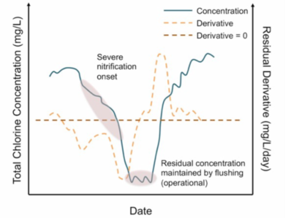

```{r setup, echo = FALSE}
knitr::opts_chunk$set(
  fig.path = "man/figures/README-"
)

```

Package to handle **D**rinking **W**ater **Q**uality issues in **R**

**This package is still in development**

This package will hold functions that will allow for calculation of different statistics for drinking water quality in drinking water distribution systems. Some of the calculations that this package will hope to address are:

* Nitrification Action Levels 
* DBP OEL and LRAA values (*currently not implemented*)


## Installation

To install this package use:

```{r, eval=FALSE}
# if you do not already have devtools installed run:
# install.packages("devtools")

devtools::install_github("tbradley1013/dwqr")

```


```{r load-packages}
library(dwqr)
library(tidyverse)
```

## Nitrification

Nitrification is a common problem for many utilites that use chloramines as a secondary disinfectant. As chloramines decay, free ammonia is released. This free ammonia acts as food for ammonia and nitrite oxidizing bacteria (AOB and NOB, respectively). As the population of AOB and NOB increase, the problem is exacerbated causing chloramine to decay faster, releasing more free ammonia. The increased decay of chloramines is a major issue for water utilities as disinfectant is the main prevention of harmful bacteria from entering the water system. As a result, utitlies must establish strategies for dealing with nitrification in their distribution systems. In some states, such a Pennsylvania, regulators require a set action plan to be created in the form of a nitrification control plan. AWWA provides recommendations for dealing with nitrification and creating in their [M56 Manual: Nitrification Prevention and Control in Drinking Water]. One of the major aspects of a nitrification control is determing necessary operational responses to different levels of potential nitrification. 

But how should utilities go about deciding what these action levels should be? That is where `dwqr` comes in. `dwqr` provides functions in R that will allow for utilites to determine system or site specific action levels based on chloramine residual. Since the decay of chloramine increases as nitrification begins to occur, it is a typical indicator of when nitrification could be occurring. `nitrification_al` uses chloramine residual values to calculate action levels for nitrification control in one of two ways. 

### Falling Limb method 

This method uses a novel approach to calculate the "falling limb" of the chloramine curve. The falling limb of the curve can be visualized as follows:
    
<center>

</center>
  
  Once the falling limb of your data has been isolated, percentiles of the values that are classified as being a part of the falling limb are used as the action levels. By default the percentiles of the falling limb used are 80% (Action Level 1), 50% (Action Level 2), and 10% (Action Level 3). You can calculate them as shown below on an example dataset `nitrification` (which is included in this package):
  
```{r fl-example}
nitrification %>% 
  filter(site == "Site 1") %>% 
  nitrification_al(date_col = date, value_col = chlorine, method = "FL", rolling_window = 7)
```

You may notice that the argument `rolling_window` was set to 7. This argument helps to determine how many data points should be used to calculate the rolling mean of the chloramine residual and of its first and second derivative. This is done to prevent oversensitivity to slight changes in chloramine residual but to better capture trends in the data. By default, this argument is set to 8. To know how to best set `rolling_window`, you can visualize how the data is classified by using the `plot_fl` function. 

```{r plot-fl-7}
p <- nitrification %>% 
  filter(site == "Site 1") %>% 
  plot_fl(date_col = date, value_col = chlorine, rolling_window = 7) 

p 

```

You can see how the classifications change when the window size is changed

```{r plot-fl-12}
nitrification %>% 
  filter(site == "Site 1") %>% 
  plot_fl(date_col = date, value_col = chlorine, rolling_window = 12) 

```


In general, datasets that have more frequent data points will benefit from larger rolling windows while datasets with less frequent data points will benefit from smaller windows
