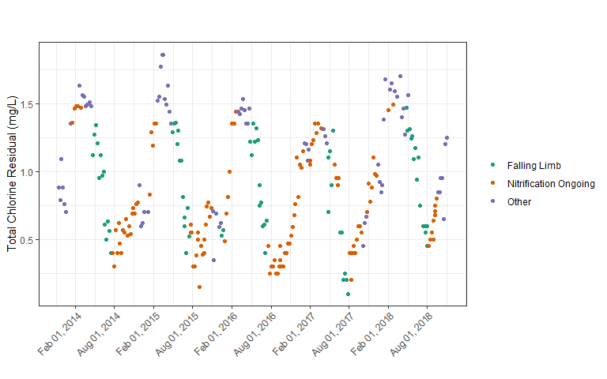

dwqr
================

Package to handle **D**rinking **W**ater **Q**uality issues in **R**

**This package is still in development**

This package will hold functions that will allow for calculation of
different statistics for drinking water quality in drinking water
distribution systems. Some of the calculations that this package will
hope to address are:

  - Nitrification Action Levels
  - DBP OEL and LRAA values (*currently not implemented*)

## Installation

To install this package use:

``` r
# if you do not already have devtools installed run:
# install.packages("devtools")

devtools::install_github("tbradley1013/dwqr")
```

``` r
library(dwqr)
library(tidyverse)
```

    ## -- Attaching packages ----------------------------------------------------------------------------------------------- tidyverse 1.2.1 --

    ## v ggplot2 3.1.0     v purrr   0.2.5
    ## v tibble  1.4.2     v dplyr   0.7.7
    ## v tidyr   0.8.2     v stringr 1.3.1
    ## v readr   1.1.1     v forcats 0.3.0

    ## -- Conflicts -------------------------------------------------------------------------------------------------- tidyverse_conflicts() --
    ## x dplyr::filter() masks stats::filter()
    ## x dplyr::lag()    masks stats::lag()

## Nitrification

Nitrification is a common problem for many utilites that use chloramines
as a secondary disinfectant. As chloramines decay, free ammonia is
released. This free ammonia acts as food for ammonia and nitrite
oxidizing bacteria (AOB and NOB, respectively). As the population of AOB
and NOB increase, the problem is exacerbated causing chloramine to decay
faster, releasing more free ammonia. The increased decay of chloramines
is a major issue for water utilities as disinfectant is the main
prevention of harmful bacteria from entering the water system. As a
result, utitlies must establish strategies for dealing with
nitrification in their distribution systems. In some states, such a
Pennsylvania, regulators require a set action plan to be created in the
form of a nitrification control plan. AWWA provides recommendations for
dealing with nitrification and creating in their \[M56 Manual:
Nitrification Prevention and Control in Drinking Water\]. One of the
major aspects of a nitrification control is determing necessary
operational responses to different levels of potential nitrification.

But how should utilities go about deciding what these action levels
should be? That is where `dwqr` comes in. `dwqr` provides functions in R
that will allow for utilites to determine system or site specific action
levels based on chloramine residual. Since the decay of chloramine
increases as nitrification begins to occur, it is a typical indicator of
when nitrification could be occurring. `nitrification_al` uses
chloramine residual values to calculate action levels for nitrification
control in one of two ways.

### Falling Limb method

This method uses a novel approach to calculate the “falling limb” of the
chloramine curve. The falling limb of the curve can be visualized as
follows:

<center>


</center>

Once the falling limb of your data has been isolated, percentiles of the
values that are classified as being a part of the falling limb are used
as the action levels. By default the percentiles of the falling limb
used are 80% (Action Level 1), 50% (Action Level 2), and 10% (Action
Level 3). You can calculate them as shown below on an example dataset
`nitrification` (which is included in this package):

``` r
nitrification %>% 
  filter(site == "Site 1") %>% 
  nitrification_al(date_col = date, value_col = chlorine, method = "FL", rolling_window = 7)
```

    ## # A tibble: 1 x 3
    ##   `Action Level 1` `Action Level 2` `Action Level 3`
    ##              <dbl>            <dbl>            <dbl>
    ## 1             1.24             0.92            0.435

You may notice that the argument `rolling_window` was set to 7. This
argument helps to determine how many data points should be used to
calculate the rolling mean of the chloramine residual and of its first
and second derivative. This is done to prevent oversensitivity to slight
changes in chloramine residual but to better capture trends in the data.
By default, this argument is set to 8. To know how to best set
`rolling_window`, you can visualize how the data is classified by using
the `plot_fl` function.

``` r
nitrification %>% 
  filter(site == "Site 1") %>% 
  plot_fl(date_col = date, value_col = chlorine, rolling_window = 7,
          ylab = "Total Chlorine Residual (mg/L)") + 
  theme(axis.text.x = element_text(angle = 45, hjust = 1, vjust = 1))
```

<!-- -->

You can see how the classifications change when the window size is
changed

``` r
nitrification %>% 
  filter(site == "Site 1") %>% 
  plot_fl(date_col = date, value_col = chlorine, rolling_window = 12, 
          ylab = "Total Chlorine Residual (mg/L)",)  + 
  theme(axis.text.x = element_text(angle = 45, hjust = 1, vjust = 1))
```

<!-- -->

In general, datasets that have more frequent data points will benefit
from larger rolling windows while datasets with less frequent data
points will benefit from smaller windows.

You can assess how well these action levels categorize a given dataset
by using the `plot_al` function.

``` r
nitrification %>% 
  filter(site == "Site 1") %>% 
  plot_al(date_col = date, value_col = chlorine, 
          ylab = "Total Chlorine Residual (mg/L)", rolling_window = 7) + 
  theme(axis.text.x = element_text(angle = 45, hjust = 1, vjust = 1))
```

<!-- -->

### General Percentiles

The second method that can be used to create action levels is general
percentiles. In this case, rather than taking percentiles of a subset of
the data (as in the falling limb mehtod), percentiles are taken of the
overall data. By default, the percentiles selected are the same as the
ones used in the falling limb method (80%, 50%, and 10%).

This option is done by setting `method = "P"`.

``` r
nitrification %>% 
  filter(site == "Site 1") %>% 
  nitrification_al(date_col = date, value_col = chlorine, method = "P",
                   ylab = "Total Chlorine Residual (mg/L)",)
```

    ## # A tibble: 1 x 4
    ##   ylab                  `Action Level 1` `Action Level 2` `Action Level 3`
    ##   <chr>                            <dbl>            <dbl>            <dbl>
    ## 1 Total Chlorine Resid~             1.35             0.81              0.4

Similar to the falling lumb method, you can plot the classification of
data points to see how well these action levels classify the data by
using the `plot_al` function.

``` r
nitrification %>% 
  filter(site == "Site 1") %>% 
  plot_al(date_col = date, value_col = chlorine, method = "P",
          ylab = "Total Chlorine Residual (mg/L)") + 
  theme(axis.text.x = element_text(angle = 45, hjust = 1, vjust = 1))
```

    ## Warning: Removed 2 rows containing missing values (geom_point).

<!-- -->

### Mutliple Sites

`dwqr`’s nitrification functions allow for multiple sites to be passed
to them so that site specific action levels can be generated. This is
done by passing all grouping columns as unnmaed arguments after the
`date_col` and `value_col` columns. In the case of our `nitrification`
dataset, this would be the `site` column. You may have noticed that I
was using a `filter` statement in the code above to only include data
for “Site 1”. Now let’s try the same thing as before but set the `site`
column as a grouping variable.

``` r
nitrification %>% 
  nitrification_al(date_col = date, value_col = chlorine, site)
```

    ## # A tibble: 2 x 4
    ##   site   `Action Level 1` `Action Level 2` `Action Level 3`
    ##   <chr>             <dbl>            <dbl>            <dbl>
    ## 1 Site 1             1.08             1.05             1.05
    ## 2 Site 2             1.31             0.9              0.3

As we can see, there is now action levels generated for each of the
sites in the data set\! If a grouping variable is passed to one of the
plotting functions, the groups are separated by `facet_wrap` in the
`ggplot2` package.

``` r
nitrification %>% 
  plot_fl(date_col = date, value_col = chlorine, site,
          ylab = "Total Chlorine Residual (mg/L)",
          ncol = 1) + 
  theme(axis.text.x = element_text(angle = 45, hjust = 1, vjust = 1))
```

<!-- -->

### Plotting the first derivative and nitrite

The `plot_fl` function also allowd for users to plot the first
derivative of the chlorine trend (a key component in the calculation of
the falling limb) and any associated nitrite data. In order to include
the first derivative plot, you simply must set `include_first = TRUE`.

``` r
nitrification %>% 
  filter(site == "Site 1") %>% 
  plot_fl(
    date_col = date, value_col = chlorine, 
    rolling_window = 7, include_first = TRUE,
    ylab = "Total Chlorine Residual (mg/L)",
    theme = theme(
      axis.text.x = element_text(angle = 45, hjust = 1, vjust = 1)
    )
  )
```

    ## Warning: Removed 6 rows containing missing values (geom_path).

<!-- -->

**NOTE:** In this past plot, the `theme` argument was used inside of
`plot_fl`. When either the first derivative or nitrite plots are
included with your falling limb plot, you must specify all ggplot2 theme
elements with the `theme` argument. This will apply your desired themes
to all of the plots. Otherwise, it will only apply it to the last plot.

To plot nitrite data with the falling limb classification, the nitrite
data must be in a separate column with corresponding sample points lined
up. You can use the `nitrification` data set as an example.

``` r
nitrification
```

    ## # A tibble: 536 x 4
    ##    site   date       chlorine nitrite
    ##    <chr>  <date>        <dbl>   <dbl>
    ##  1 Site 1 2013-10-02     0.66   0.195
    ##  2 Site 1 2013-10-09     0.54   0.198
    ##  3 Site 1 2013-10-16     0.7    0.189
    ##  4 Site 1 2013-10-23     0.68   0.211
    ##  5 Site 1 2013-10-30     0.52   0.181
    ##  6 Site 1 2013-11-06     0.65   0.133
    ##  7 Site 1 2013-11-13     0.88   0.105
    ##  8 Site 1 2013-11-20     0.79   0.102
    ##  9 Site 1 2013-11-27     1.09   0.064
    ## 10 Site 1 2013-12-04     0.88   0.058
    ## # ... with 526 more rows

Plotting the two together would look like this.

``` r
nitrification %>% 
  filter(site == "Site 1") %>% 
  plot_fl(
    date_col = date, value_col = chlorine, 
    rolling_window = 7, nitrite_col = nitrite,
    ylab = "Total Chlorine Residual (mg/L)",
    nitrite_ylab = "Nitrite (mg N/L)",
    theme = theme(
      axis.text.x = element_text(angle = 45, hjust = 1, vjust = 1)
    )
  )
```

    ## Warning: Removed 1466 rows containing missing values (geom_point).

<!-- -->

-----

### A quick note of tidy eval

This packages uses [tidy
eval](https://dplyr.tidyverse.org/articles/programming.html) via the
[`rlang`](https://github.com/r-lib/rlang) package. This is why the
column names of the `date_col` and `value_col` are passed to the
nitrification functions as unquoted variable names rather than strings.
This is also what allows for the grouping variables to be set
dynamically by the user. It is important to keep this in mind as you use
this package as passing a quoted column name will result in an error.
